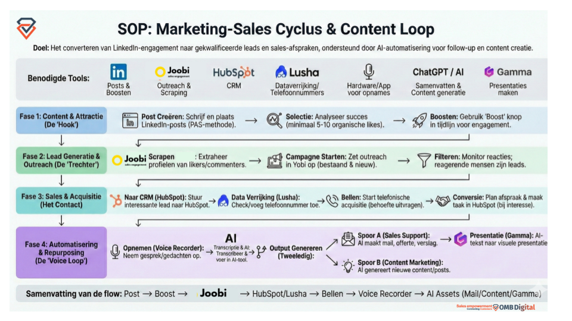

# OMB Sales Cycle Skills for Claude

> The complete Marketing → Sales → Voice Loop system as Claude Code skills.
> Built by [OMB Digital](https://www.ombdigital.io) — the Claude + Sales agency.



This is the exact SOP OMB Digital uses to turn LinkedIn engagement into qualified
leads and closed deals, packaged as 5 modular [Claude Code skills](https://docs.claude.com/en/docs/claude-code/skills).
Install the full cycle or just the phase you need.

---

## What's inside

| Skill | Phase | What it does |
|---|---|---|
| `omb-sales-cycle` | Orchestrator | Runs all 4 phases end-to-end |
| `omb-hook` | 1. Content & Attractie | LinkedIn posts (PAS method) + AI Journalist + boost timing |
| `omb-funnel` | 2. Lead Generatie & Outreach | Scrape likers/commenters → filter → outreach campaign |
| `omb-contact` | 3. Sales & Acquisitie | HubSpot + Lusha enrichment + call script + conversion |
| `omb-voiceloop` | 4. Automatisering & Repurposing | Joobi voice recorder → transcript → mail/Gamma/repurposed posts |

Skills are standalone — use one, some, or all.

---

## Install

**Requires:** [Claude Code](https://claude.com/claude-code) installed.

```bash
git clone https://github.com/Javelin-OMB/omb-sales-cycle-skills.git
cd omb-sales-cycle-skills
./install.sh
```

The installer symlinks the skills into `~/.claude/skills/`. Restart Claude Code
and the skills activate automatically when you mention the triggers (e.g.
"draai een LinkedIn campagne", "maak een outreach lijst", "transcribeer deze opname").

**Update:** `git pull` inside the cloned folder. No re-install needed.

**Uninstall:** `./install.sh --uninstall`

---

## Recommended stack

These skills work best with the tools OMB Digital uses:

- **LinkedIn** — posts & boosting
- **[Joobi Sales Engagement](https://www.joobi.io)** — scraping likers/commenters + outreach
- **HubSpot** — CRM (via Claude's HubSpot MCP)
- **Lusha** — phone number enrichment
- **Joobi Voice Recorder** — call/meeting capture
- **Gamma** — AI presentations (via Gamma MCP)

Skills fall back to generic instructions if you don't have a specific tool — but
the recommended stack is what delivers the best results.

---

## Want OMB to run this for you?

These skills teach Claude **how** to do it. If you'd rather have a team
**execute** it end-to-end, three doors:

- 🎯 **[LinkedIn Outreach Campaigns](https://www.ombdigital.io)** — we run the full cycle as a service
- 📞 **[Joobi.ai Voice Agents](https://www.joobi.io)** — 24/7 AI phone assistant for your business
- 🎙️ **AI Journalist setup** — we install the content-loop that turns your voice into weekly posts, mails, and decks

Book: [ombdigital.io/meetings/tom-spoor1](https://ombdigital.io/meetings/tom-spoor1)

---

## Philosophy

Most "AI sales" tools automate the wrong part. The magic isn't in sending 500
messages — it's in the **loop**: one captured conversation becomes a post, a
mail, a proposal, a deck, and the next campaign hook. These skills enforce that
loop so nothing your brain produces gets thrown away.

---

## License

MIT — use it, fork it, remix it. Attribution to OMB Digital appreciated but
not required.

## Credits

Built by [Tom Spoor](https://www.linkedin.com/in/tomspoor) & the OMB Digital team.
SOP originally developed for OMB Digital + Joobi.ai internal sales ops.

Questions / issues / ideas: [open an issue](https://github.com/Javelin-OMB/omb-sales-cycle-skills/issues)
or mail tom.spoor@ombdigital.io.
